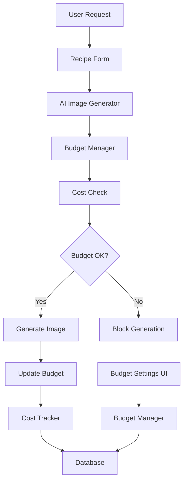

# AI Image Generation Budget System

This document provides comprehensive documentation for the AI Image Generation Budget System, which manages user spending limits and cost tracking for AI-generated recipe images.

## 📋 Table of Contents

- [Overview](#overview)
- [Architecture](#architecture)
- [Database Schema](#database-schema)
- [Core Components](#core-components)
- [Budget Management Flow](#budget-management-flow)
- [Cost Tracking](#cost-tracking)
- [User Interface](#user-interface)
- [Error Handling](#error-handling)
- [Security & RLS](#security--rls)
- [Troubleshooting](#troubleshooting)

## 🎯 Overview

The AI Image Generation Budget System provides:

- **Monthly Budget Limits**: Users can set spending limits for AI image generation
- **Cost Tracking**: Automatic tracking of image generation costs
- **Budget Enforcement**: Prevents users from exceeding their budget limits
- **User Settings**: Interface for managing budget preferences
- **Cost Analytics**: Historical spending data and usage patterns

### Key Features

- ✅ **Automatic Budget Creation**: New users get default $10/month budget
- ✅ **Real-time Cost Tracking**: Tracks costs as images are generated
- ✅ **Budget Enforcement**: Blocks generation when limits are exceeded
- ✅ **User Settings UI**: Comprehensive budget management interface
- ✅ **Error Resilience**: Graceful handling of budget system failures

## 🏗️ Architecture



### Component Relationships

- **Budget Manager**: Core logic for budget operations
- **Cost Tracker**: Tracks individual generation costs
- **Budget Settings UI**: User interface for budget management
- **Database**: Stores budget data and cost history

## 🗄️ Database Schema

### `user_budgets` Table

```sql
CREATE TABLE user_budgets (
    user_id UUID PRIMARY KEY REFERENCES auth.users(id),
    monthly_budget NUMERIC NOT NULL,
    used_monthly NUMERIC NOT NULL DEFAULT 0,
    period_start TIMESTAMPTZ NOT NULL,
    updated_at TIMESTAMPTZ NOT NULL DEFAULT NOW()
);
```

### `image_generation_costs` Table

```sql
CREATE TABLE image_generation_costs (
    id UUID PRIMARY KEY DEFAULT gen_random_uuid(),
    user_id UUID NOT NULL REFERENCES auth.users(id),
    prompt TEXT NOT NULL,
    size TEXT NOT NULL,
    quality TEXT NOT NULL,
    cost NUMERIC NOT NULL,
    success BOOLEAN NOT NULL,
    image_url TEXT,
    generation_time_ms INTEGER,
    error_message TEXT,
    created_at TIMESTAMPTZ NOT NULL DEFAULT NOW()
);
```

## 🔧 Core Components

### 1. Budget Manager (`budget-manager.ts`)

**Location**: `src/lib/ai-image-generation/budget-manager.ts`

**Key Functions**:

- `getUserBudget()`: Get or create user budget
- `updateUserBudget()`: Update budget settings
- `updateBudgetAfterGeneration()`: Track spending after generation
- `canGenerateImage()`: Check if generation is allowed

**Interface**:
```typescript
interface UserBudget {
  user_id: string;
  monthly_budget: number;
  used_monthly: number;
  period_start: string;
  updated_at: string;
}
```

### 2. Budget Settings UI (`budget-settings.tsx`)

**Location**: `src/components/settings/budget-settings.tsx`

**Features**:
- Monthly budget configuration
- Current spending display
- Budget status alerts
- Cost reference information

### 3. Cost Tracker (`cost-tracker.ts`)

**Location**: `src/lib/ai-image-generation/cost-tracker.ts`

**Functions**:
- `calculateImageCost()`: Calculate cost based on size/quality
- `trackImageGenerationCost()`: Record generation costs
- `getUserCostSummary()`: Get user spending analytics

## 🔄 Budget Management Flow

### 1. User Registration
```typescript
// Automatic budget creation for new users
const defaultBudget: UserBudget = {
  user_id: targetUserId,
  monthly_budget: 10, // $10/month default
  used_monthly: 0,
  period_start: new Date().toISOString(),
  updated_at: new Date().toISOString(),
};
```

### 2. Image Generation Request
```typescript
// Check budget before generation
const budgetCheck = await canGenerateImage(expectedCost);
if (!budgetCheck.allowed) {
  return {
    success: false,
    error: budgetCheck.reason || 'Budget limit exceeded',
  };
}
```

### 3. Cost Tracking
```typescript
// Update budget after successful generation
await updateBudgetAfterGeneration(actualCost);
```

## 💰 Cost Tracking

### Cost Calculation

| Size | Quality | Cost |
|------|---------|------|
| 1024x1024 | Standard | $0.04 |
| 1024x1024 | HD | $0.08 |
| 1024x1792 | Standard | $0.08 |
| 1024x1792 | HD | $0.12 |
| 1792x1024 | Standard | $0.08 |
| 1792x1024 | HD | $0.12 |

### Cost Tracking Flow

1. **Pre-generation**: Calculate expected cost
2. **Budget Check**: Verify user has sufficient budget
3. **Generation**: Create image via AI service
4. **Post-generation**: Record actual cost and update budget

## 🎨 User Interface

### Budget Settings Page

**Features**:
- **Current Status**: Shows remaining budget and usage
- **Monthly Limit**: Primary budget configuration
- **Cost Reference**: Information about image generation costs
- **Budget Alerts**: Warnings when budget is exceeded

**UI Components**:
- Budget status display
- Monthly limit input
- Save/update functionality
- Cost information alerts

### Budget Status Display

```typescript
// Current budget status
<div className="text-2xl font-bold text-purple-600">
  {formatCurrency(budgetStatus.monthly_budget - budgetStatus.used_monthly)}
</div>
<div className="text-sm text-gray-600">Monthly Remaining</div>
```

## ⚠️ Error Handling

### Budget System Failures

The system is designed to be **non-blocking** - if the budget system fails, image generation continues:

```typescript
try {
  const budget = await getUserBudget(userId);
  // ... budget logic
} catch (error) {
  console.warn('Budget check failed, allowing generation:', error);
  return { allowed: true }; // Fail open
}
```

### Common Error Scenarios

1. **Authentication Issues**: User not properly authenticated
2. **Database Errors**: RLS policy violations or connection issues
3. **Budget Creation Failures**: Unable to create default budget
4. **Cost Tracking Failures**: Unable to update spending records

### Error Recovery

- **Graceful Degradation**: System continues working without budget enforcement
- **User Notifications**: Toast messages for budget-related errors
- **Logging**: Comprehensive error logging for debugging

## 🔒 Security & RLS

### Row Level Security Policies

```sql
-- Users can view their own budget
CREATE POLICY "Users can view their own budget" ON user_budgets
  FOR SELECT USING (auth.uid() = user_id);

-- Users can update their own budget
CREATE POLICY "Users can update their own budget" ON user_budgets
  FOR UPDATE USING (auth.uid() = user_id);

-- Users can upsert their own budget
CREATE POLICY "Users can upsert their own budget" ON user_budgets
  FOR INSERT WITH CHECK (auth.uid() = user_id);
```

### Security Features

- **User Isolation**: Users can only access their own budget data
- **Authentication Required**: All operations require valid user session
- **Data Validation**: Input validation for budget amounts
- **Audit Trail**: All budget changes are timestamped

## 🐛 Troubleshooting

### Common Issues

#### 1. 404 Errors for `user_budgets` Table

**Symptoms**:
```
GET user_budgets?select=*&user_id=eq.xxx 404 (Not Found)
POST user_budgets?select=* 404 (Not Found)
```

**Causes**:
- User not authenticated
- RLS policy violations
- Missing budget record for new user

**Solutions**:
- Verify user authentication status
- Check RLS policies are correctly configured
- Ensure budget creation logic is working

#### 2. Budget Not Created for New Users

**Symptoms**:
- New users can't access budget settings
- Budget checks fail for new users

**Causes**:
- `getUserBudget()` function not called
- Budget creation logic failing
- Database permissions issues

**Solutions**:
- Check `getUserBudget()` is called during user onboarding
- Verify budget creation logic in `budget-manager.ts`
- Test database permissions for new users

#### 3. Cost Tracking Not Working

**Symptoms**:
- Budget not updated after image generation
- Spending not reflected in budget status

**Causes**:
- `updateBudgetAfterGeneration()` not called
- Cost tracking database errors
- Budget update logic failing

**Solutions**:
- Verify cost tracking is called after successful generation
- Check `updateBudgetAfterGeneration()` implementation
- Test budget update database operations

### Debugging Steps

1. **Check Authentication**:
   ```typescript
   const { data: user } = await supabase.auth.getUser();
   console.log('User authenticated:', !!user?.user);
   ```

2. **Verify Budget Record**:
   ```sql
   SELECT * FROM user_budgets WHERE user_id = 'user-id';
   ```

3. **Test Budget Operations**:
   ```typescript
   try {
     const budget = await getUserBudget();
     console.log('Budget loaded:', budget);
   } catch (error) {
     console.error('Budget error:', error);
   }
   ```

4. **Check RLS Policies**:
   ```sql
   SELECT * FROM pg_policies WHERE tablename = 'user_budgets';
   ```

## 📊 Monitoring & Analytics

### Key Metrics

- **Budget Utilization**: Percentage of monthly budget used
- **Generation Success Rate**: Successful vs failed generations
- **Cost Per Generation**: Average cost per image
- **User Spending Patterns**: Daily/weekly/monthly trends

### Cost Analytics

The system provides detailed cost analytics through the `getUserCostSummary()` function:

- Total spending by period
- Cost breakdown by image size/quality
- Generation success rates
- Spending trends over time

## 🔮 Future Enhancements

### Planned Features

1. **Daily/Weekly Limits**: Additional budget constraints
2. **Budget Alerts**: Email/notification system for budget warnings
3. **Cost Optimization**: Smart size/quality recommendations
4. **Budget Analytics**: Advanced spending insights
5. **Family Budgets**: Shared budgets for multiple users

### Technical Improvements

1. **Caching**: Budget data caching for performance
2. **Batch Updates**: Efficient bulk budget updates
3. **Real-time Updates**: Live budget status updates
4. **API Rate Limiting**: Budget-based rate limiting
5. **Cost Prediction**: ML-based cost estimation

---

## 📚 Related Documentation

- [AI Image Generation System](./ai-image-generation.md)
- [Cost Tracking System](./cost-tracking.md)
- [User Settings System](./user-settings.md)
- [Database Schema](../supabase/database-schema.md)
- [Security & RLS](../supabase/security-rls.md)
