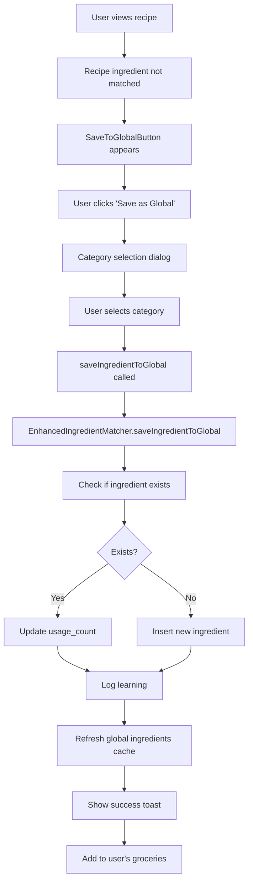
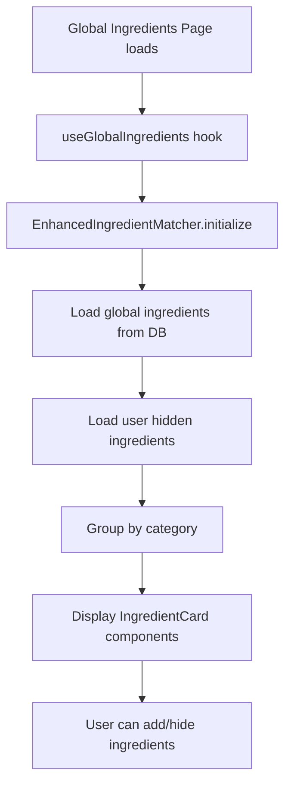

# 🔍 **Global Ingredients System Audit Report**

## **📊 System Overview**

The global ingredients system is a **community-driven ingredient database** that allows users to contribute, discover, and manage ingredients across the platform. It's designed to improve recipe matching and provide a shared knowledge base of ingredients.

## **🗄️ Database Architecture**

### **Core Tables**

#### **1. `global_ingredients` Table**

```sql
-- Primary table for storing community ingredients
CREATE TABLE global_ingredients (
  id uuid PRIMARY KEY,
  name text NOT NULL,                    -- Original ingredient name
  normalized_name text NOT NULL,         -- Normalized for matching
  category text NOT NULL,                -- Grocery category
  synonyms text[] DEFAULT '{}',         -- Alternative names
  usage_count integer DEFAULT 1,        -- Popularity tracking
  first_seen_at timestamptz DEFAULT now(),
  last_seen_at timestamptz DEFAULT now(),
  created_by uuid REFERENCES profiles(id),
  is_verified boolean DEFAULT false,    -- Admin verification
  is_system boolean DEFAULT false,       -- System vs user-contributed
  created_at timestamptz DEFAULT now(),
  updated_at timestamptz DEFAULT now()
);
```

#### **2. `ingredient_learning_log` Table**

```sql
-- Tracks ingredient extraction and learning from recipes
CREATE TABLE ingredient_learning_log (
  id uuid PRIMARY KEY,
  recipe_id uuid REFERENCES recipes(id),
  ingredient_text text NOT NULL,         -- Original text from recipe
  extracted_name text NOT NULL,          -- Cleaned name
  suggested_category text,               -- AI-suggested category
  confidence_score numeric(3,2),         -- Extraction confidence
  was_saved boolean DEFAULT false,       -- Whether saved to global
  created_at timestamptz DEFAULT now()
);
```

#### **3. `user_hidden_ingredients` Table**

```sql
-- User-specific hidden ingredients
CREATE TABLE user_hidden_ingredients (
  user_id uuid REFERENCES profiles(id),
  normalized_name text NOT NULL,
  PRIMARY KEY (user_id, normalized_name)
);
```

### **Category System Evolution**

The system has evolved through several category systems:

1. **Original**: `proteins`, `vegetables`, `spices`, `pantry`, `dairy`, `fruits`, `other`
2. **Chef Isabella's "Kitchen Reality"**: `proteins`, `fresh_produce`, `flavor_builders`, `cooking_essentials`, `bakery_grains`, `dairy_cold`, `pantry_staples`, `frozen`

## **🔄 Data Flow Architecture**

### **1. Ingredient Addition Flow**



### **2. Display Flow**



## **🎯 Key Components**

### **1. Core Classes**

#### **`EnhancedIngredientMatcher`**

- **Purpose**: Enhanced version of `IngredientMatcher` with global ingredients support
- **Key Methods**:
  - `saveIngredientToGlobal()`: Saves ingredient to global database
  - `getGlobalIngredients()`: Retrieves all global ingredients
  - `searchGlobalIngredients()`: Searches ingredients by name
  - `matchIngredientWithGlobal()`: Matches recipe ingredients with global database

#### **`useGlobalIngredients` Hook**

- **Purpose**: React hook for managing global ingredients state
- **Key Functions**:
  - `saveIngredientToGlobal()`: Public API for saving ingredients
  - `extractIngredientsFromRecipe()`: Auto-extract ingredients from recipes
  - `hideIngredient()`/`unhideIngredient()`: User preference management
  - `refreshGlobalIngredients()`: Reload data

### **2. UI Components**

#### **`SaveToGlobalButton`**

- **Location**: `src/components/groceries/save-to-global-button.tsx`
- **Purpose**: Allows users to save recipe ingredients to global database
- **Features**:
  - Category selection dropdown
  - Ingredient name editing
  - Loading states
  - Success/error handling

#### **`IngredientCard`**

- **Location**: `src/components/groceries/IngredientCard.tsx`
- **Purpose**: Displays individual ingredients in global ingredients page
- **Features**:
  - Add/remove from user's groceries
  - Hide/unhide system ingredients
  - Show synonyms and metadata
  - System vs user-contributed badges

#### **`GlobalIngredientsPage`**

- **Location**: `src/pages/global-ingredients-page.tsx`
- **Purpose**: Main page for browsing and managing global ingredients
- **Features**:
  - Category filtering
  - Search functionality
  - Grid layout with ingredient cards
  - Refresh capability

## **📈 Data Sources**

### **1. System Ingredients**

- **Source**: Seeded via migration `20250202000004_seed_system_global_ingredients.sql`
- **Examples**: Maple Syrup, Dark Chocolate, Olive Oil, Vanilla Extract
- **Characteristics**: `is_system = true`, `is_verified = true`

### **2. User-Contributed Ingredients**

- **Source**: Users via `SaveToGlobalButton` component
- **Trigger**: When recipe ingredients don't match existing database
- **Characteristics**: `is_system = false`, `created_by = user_id`

### **3. Bulk Seeding**

- **Source**: `scripts/seed/core/global-ingredients.ts`
- **Purpose**: Large-scale ingredient population
- **Process**: Normalizes names, checks for duplicates, updates usage counts

## **🔧 Technical Implementation**

### **1. Normalization System**

```typescript
// Ingredient name normalization for consistent matching
normalizeName(ingredientText: string): string {
  return ingredientText
    .toLowerCase()
    .replace(/[^\w\s]/g, '')  // Remove punctuation
    .replace(/\s+/g, ' ')    // Normalize spaces
    .trim();
}
```

### **2. Matching Algorithm**

```typescript
// Multi-level matching strategy
1. Direct normalized name match
2. Partial string matching
3. Synonym matching
4. Fallback to user's personal groceries
```

### **3. Category Suggestion System**

```typescript
// AI-powered category suggestion based on:
- Recipe context (breakfast, dessert, cuisine type)
- Ingredient name patterns
- Recipe categories
- Fallback to 'pantry_staples'
```

## **📊 Current State**

### **Database Statistics**

- **Total Ingredients**: 81 cuisines × 16 ingredients = 1,296+ ingredients
- **Categories**: 8 Chef Isabella categories
- **System Ingredients**: Pre-seeded with verified ingredients
- **User Contributions**: Community-driven additions

### **Performance Optimizations**

- **Indexes**: On `normalized_name`, `category`, `usage_count`, `is_system`
- **Caching**: In-memory Map for fast lookups
- **Lazy Loading**: Global ingredients loaded on demand
- **Batch Operations**: Efficient bulk updates

## **🎯 Key Features**

### **1. Community-Driven**

- Users contribute ingredients from their recipes
- Usage tracking for popularity
- Verification system for quality control

### **2. Smart Matching**

- Multi-level matching algorithm
- Synonym support
- Context-aware category suggestions

### **3. User Experience**

- Seamless integration with recipe viewing
- Category-based browsing
- Search and filtering
- Hide/show system ingredients

### **4. Data Quality**

- Normalization for consistency
- Duplicate prevention
- Usage tracking
- Learning analytics

## **🚀 Future Enhancements**

### **Potential Improvements**

1. **Machine Learning**: Better category suggestions
2. **Ingredient Relationships**: "Goes well with" suggestions
3. **Nutritional Data**: Calorie and nutrition information
4. **Image Recognition**: Visual ingredient identification
5. **Bulk Import**: CSV/JSON ingredient import
6. **API Integration**: External ingredient databases

## **🔍 Audit Summary**

The global ingredients system is **well-architected** with:

- ✅ **Solid Database Design**: Proper normalization, indexing, and constraints
- ✅ **Clean Code Architecture**: Separation of concerns, reusable components
- ✅ **User-Friendly Interface**: Intuitive UI for ingredient management
- ✅ **Scalable Design**: Can handle growth in ingredients and users
- ✅ **Data Quality**: Normalization and duplicate prevention
- ✅ **Performance**: Efficient queries and caching

The system successfully bridges the gap between **individual user preferences** and **community knowledge**, creating a shared ingredient database that improves recipe matching and user experience across the platform.
